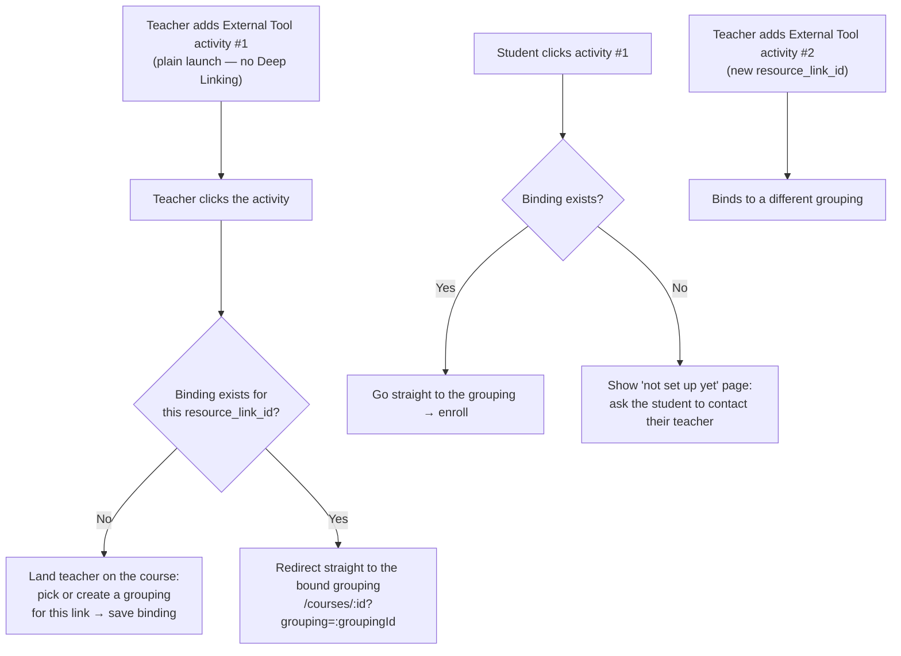
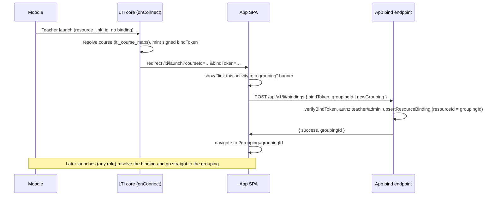

# Architecture

## Module Layout

```
┌──────────────────────────────────────────────────────────┐
│  LTI Core (generic, no DB knowledge)                     │
│  ┌────────────┐ ┌───────────┐ ┌──────────────────┐       │
│  │  core.ts   │ │ helpers.ts│ │ deepLinkingUI.ts │       │
│  │  ltijs +   │ │  pure     │ │ server-rendered  │       │
│  │  routes +  │ │  utils    │ │ HTML fallbacks   │       │
│  │  handlers  │ │           │ │ (Vue UI in       │       │
│  │            │ │           │ │  frontend/)      │       │
│  └─────┬──────┘ └───────────┘ └──────────────────┘       │
│        │ calls adapter.*()                               │
├────────┼─────────────────────────────────────────────────┤
│        ▼                                                 │
│  ┌──────────────────────────────┐                        │
│  │  LtiAdapter interface        │   (types.ts)           │
│  │  - resolveTeacherByEmail()   │                        │
│  │  - listCoursesForTeacher()   │                        │
│  │  - listSelectableResources() │                        │
│  │  - upsertCourseMap()         │                        │
│  │  - generateJwt()             │                        │
│  │  - ...30+ methods            │                        │
│  └──────────────┬───────────────┘                        │
│                 │                                        │
├─────────────────┼────────────────────────────────────────┤
│  Adapters       │  (project-specific)                    │
│  ┌──────────────┴───────────────┐                        │
│  │  mongoose.example.ts         │  ← ready-to-copy       │
│  │  (or) drizzle.example.ts     │  ← ready-to-copy       │
│  │  (or) write your own         │                        │
│  └──────────────────────────────┘                        │
└──────────────────────────────────────────────────────────┘
```

## Core Design Principles

### 1. Adapter Pattern — Core Never Touches the Database

`core.ts` calls `adapter.methodName()` for every project-specific operation. It never imports Mongoose, Drizzle, Supabase, or any DB library. New projects implement `LtiAdapter` (in `types.ts`) for their own data layer.

This is what makes the module portable. You can switch from MongoDB to Postgres without touching `core.ts`.

### 2. Shared Types Are Protocol-Agnostic

Types in `types.ts` (`LtiUser`, `LtiCourse`, `LtiResource`, `LtiPlatformContext`, etc.) describe **domain concepts**, not protocol details. Both the LTI 1.3 path and the LTI 1.0a/1.1 path map their (very different) wire payloads onto the same shared types via a `NormalizedLaunch` value, then call **one** handler — see "Normalized launch handling" below.

### 3. Helpers Are Pure Functions

`helpers.ts` has no side effects, no DB access, no Express middleware — just token parsing and URL helpers. Use them anywhere.

## Connect Modes

A deployment picks one flow via `connectMode` (`LtiInitOptions`, mirrored by the
app's `LTI_CONNECT_MODE` env). All modes share the same OIDC login + launch
handshake; they differ in what happens after the launch JWT is validated.

| Mode | LMS requirement | Launch resolves to | How a target is bound | Adapter |
|------|-----------------|--------------------|-----------------------|---------|
| `login-only` | none (SSO only) | the app dashboard | nothing — identity only | `LtiLoginOnlyAdapter` (~3 methods) |
| `context-mapping` | plain external tool | a course (then in-app grouping pick) | course via `lti_course_maps` | full `LtiAdapter` |
| `context-mapping` + per-link binding | plain external tool | a specific grouping | `resource_link_id` → grouping, set in-app via a bind token | full `LtiAdapter` |
| `deep-linking` | LMS "Select content" | a specific resource | teacher binds via Moodle's content picker | full `LtiAdapter` |

**Recommended:** `login-only` or `context-mapping` (optionally with per-link
binding). `deep-linking` is the richest but only works when the LMS exposes Deep
Linking — many production Moodle instances (including HKU's) disable it, so do
not depend on it unless you have confirmed "Select content" is available.

The sections below describe each flow; the generic launch diagram immediately
following is the **deep-linking** case.

## Normalized launch handling (1.3 + 1.0a/1.1)

Both protocols converge on a single code path. Each transport adapter builds a
`NormalizedLaunch` — a protocol-agnostic snapshot of the launch (version, user
identity + roles, context/resource-link identifiers, custom params, the resolved
app role, and the grade-link target if any) — and passes it to
`handleNormalizedLaunch()` in `launchHandler.ts`:

```
LTI 1.3 (ltijs onConnect)  ─┐
                            ├─▶  NormalizedLaunch  ─▶  handleNormalizedLaunch()
LTI 1.0a/1.1 (OAuth1 POST) ─┘                          (provision course, enroll,
                                                        resolve role, mint session)
```

This keeps `core.ts` (the ltijs/1.3 orchestration) and `legacy/lti11.ts` (the
1.0a/1.1 router) thin: each only does transport-specific validation, then defers
all the domain work to the shared handler — which still calls only the adapter.

## LTI 1.0a / 1.1 path (legacy, optional)

Off by default; enabled with `legacyLti`. Unlike 1.3 there is no OIDC round-trip
or JWK discovery — the LMS sends a single OAuth 1.0a HMAC-SHA1-signed form POST
keyed by a shared consumer secret.

```
Legacy LMS                     Tool (legacy router)             Your App (SPA)
     │                               │                              │
     │  1. Signed launch POST        │                              │
     │  POST /lti/legacy/launch ────▶│                              │
     │                               │  2. Verify OAuth 1.0a sig    │
     │                               │     (consumerStore secret,   │
     │                               │      timestamp + nonceStore) │
     │                               │  3. Build NormalizedLaunch   │
     │                               │     → handleNormalizedLaunch │
     │                               │  4. Record grade link        │
     │                               │  5. Mint signed launch ticket│
     │                               │  6. Redirect ?ticket=… ─────▶│
     │                               │                              │
     │                               │  7. GET /legacy/session ◀────│
     │                               │  8. Verify ticket → app JWT ─▶│
```

Key components: `legacy/oauth1.ts` (RFC 5849 HMAC-SHA1 verify/sign with
`oauth_body_hash`), `legacy/nonceStore.ts` (replay protection),
`legacy/lti11.ts` (router + param→`NormalizedLaunch` mapping + ticket bridge),
`legacy/contentItem.ts` (Content-Item deep linking return form), and
`legacy/outcomes.ts` (Basic Outcomes grade passback). The **launch ticket** is
the 1.1 analogue of ltijs's `ltik`: a short-lived signed token the SPA exchanges
for an app JWT, since there is no ltijs session for legacy launches.

### Grade passback

A launch records its grade target (1.1 Basic Outcomes service URL + `sourcedId`,
or 1.3 AGS endpoint) in an `LtiGradeLinkStore`. The host calls one facade,
`sendScore()` (`grades/sendScore.ts`), which dispatches to either
`legacy/outcomes.ts` (1.1) or `grades/ags.ts` (1.3 AGS, experimental). The 1.3
AGS prototype is gated behind `agsPrototype` and is **not** production-hardened.

## LTI 1.3 Flow (deep-linking)

This is the `deep-linking` mode: the launch reads a resource-link binding the
teacher created via Moodle's content picker. See **Connect Modes** above for the
other flows.

```
LMS (Moodle)                    Tool (this module)              Your App (Vue)
     │                               │                              │
     │  1. OIDC Login Request        │                              │
     │  POST /lti/login ────────────▶│                              │
     │                               │                              │
     │  2. Auth redirect             │                              │
     │◀──────────────────────────────│                              │
     │                               │                              │
     │  3. LTI Launch (id_token)     │                              │
     │  POST /lti/launch ───────────▶│                              │
     │                               │  4. Validate JWT             │
     │                               │  5. Find resource binding    │
     │                               │  6. Redirect to /lti/launch?ltik=… │
     │                               │───────────────────────────▶  │
     │                               │                              │
     │                               │  7. Session bridge call      │
     │                               │◀──── GET /lti/session ───────│
     │                               │  8. Exchange ltik → app JWT  │
     │                               │───── { token, role } ──────▶ │
     │                               │                              │
     │                               │  9. Vue Router navigates to  │
     │                               │     the bound target, e.g. /courses/:id?grouping=:groupingId
```

(Step 9's target is project-specific: this app lands on
`/courses/:id?grouping=:groupingId`; another app might land on `/agents/:id` or
`/lti/category/:id`.)

## Deep Linking Flows

Two flows exist, both submitting to the same `/deeplink/submit` backend endpoint:

| Mode | Entry Point | When Used |
|------|-------------|-----------|
| **Inline iframe (Vue)** | Moodle "Select content" → `/lti/deeplink` (popupMode=false) | Initial activity setup |
| **Popup window** | Teacher Manage page → `/lti/deeplink?popup=1` | Reconfiguring an existing activity |

In **inline mode**, the Vue form posts to `/deeplink/submit?format=json`, receives `{ jwt, returnUrl }`, and navigates the iframe back to Moodle's `deep_link_return_url` with the signed JWT.

In **popup mode**, the Vue form is opened in a separate browser window. The popup posts the selection back to the launcher iframe via `window.postMessage`, which then submits the deep link response form to Moodle. (For reconfigure, no deep-link return URL is present, so the popup just closes after persisting the binding.)

## Context-Mapping with Per-Link Grouping Binding

Some LMS deployments (e.g. the HKU Moodle instance) do **not** expose Deep Linking
/ "Select content" when adding an external tool. In that case the activity is a
plain external-tool launch, so the teacher can never use the content picker to bind
an activity to a grouping.

This flow makes each Moodle activity target a specific grouping **without Deep
Linking**, by binding on `resource_link_id`. That claim is sent on *every* LTI 1.3
resource-link launch (not just Deep Linking) and is **unique and stable per
activity**, so a second external-tool activity in the same Moodle course gets its
own `resource_link_id` and can be bound to a different grouping.

The course is still resolved from the Moodle context (`lti_course_maps`) exactly as
in plain context-mapping; the binding only adds the grouping target on top.



### Resolution matrix

| Launcher | Binding for `resource_link_id`? | Outcome |
|----------|---------------------------------|---------|
| Teacher  | Yes | Redirect to the bound grouping (manage view via role). |
| Teacher  | No  | Land on the course; teacher picks/creates a grouping, which saves the binding. |
| Student  | Yes | Redirect to the bound grouping; auto-enrolled into the course, then joins a group. |
| Student  | No  | Show a "this activity isn't set up yet — please contact your teacher" page. **No grouping picker fallback** for students. |

### Bind-token handshake

The `resource_link_id` and the platform tuple are known only inside the LTI core
at launch, but the teacher chooses the grouping later in the SPA (authenticated
by the app JWT, not the LTI token). A short-lived signed **bind token** bridges
the gap: the core mints it on a teacher launch and the SPA returns it to an
authenticated bind endpoint, which verifies it before persisting the binding.



### Storage

Reuses `lti_resource_bindings` keyed on
`(issuer, clientId, deploymentId, contextId, resourceLinkId)`. The grouping id is
stored in the existing `resourceId` slot (in this domain, a bound "resource" is a
grouping; the Mongoose example persists it in `agentId`). No schema change is
required — only the context-mapping launch path is extended to read the binding,
and the new bind endpoint writes it.

## Storage Model

Two LTI-specific tables (or Mongoose collections):

### `lti_course_maps`

One row per **LMS course context**. Maps `(issuer, clientId, deploymentId, contextId)` → your app's `courseId`. Created on a deep-linking setup, on auto-mapping, **and on a context-mapping teacher launch** (when the teacher's course is matched/provisioned); reused on subsequent launches from the same Moodle course.

### `lti_resource_bindings`

One row per **LMS activity** (resource link). Adds `resourceLinkId` to the same context tuple, plus either `resourceId` (single-resource binding) or `categoryId` (category binding). This is what the launch flow reads to decide where to redirect. In **deep-linking** it is written by the content-picker submit; in **context-mapping per-link binding** it is written by the app's bind endpoint (`POST /api/v1/lti/bindings`), and `resourceId` holds the **grouping** id.

In addition, ltijs maintains its own internal tables (`lti_*`) for storing platform metadata, public keys, nonces, etc. These are managed automatically; you don't write to them directly.

## Multi-Tenant Support

For multi-tenant apps:

1. Have your `Course` (and `Resource`) tables include a `tenantId` column.
2. In your adapter, filter all queries by `tenantId`.
3. Implement `resolveEffectiveTenant()` and `getTenantMode()` to return the active tenant.
4. The core stamps `tenantId` on every `upsertCourseMap` / `upsertResourceBinding` automatically.
5. On launch, the `/session` route resolves tenant from the binding and returns it in the response so the frontend can scope further requests.

Single-tenant apps just return `undefined` from `resolveEffectiveTenant()` and `getTenantMode()` — all the multi-tenant code paths become no-ops.

## Logging Convention

Every log call inside the core uses `logInfo` / `logWarn` / `logError`, which:

1. Wrap structured metadata into a single JSON-serialised string.
2. Forward to the injected logger (or `console` by default).

To use your own logger:

```typescript
import { setLtiLogger } from './lti';
setLtiLogger({
  info: (msg) => myLogger.info(msg),
  warn: (msg) => myLogger.warn(msg),
  error: (msg) => myLogger.error(msg),
});
```

## When Modifying the Module

| Change | File(s) to Touch |
|--------|-------------------|
| New adapter method needed | `types.ts` (interface) + your adapter implementation |
| New route | `core.ts` (register on `lti.app`, not `app`) |
| Change deep link UI text/layout | `frontend/src/views/LtiDeepLinkView.vue` |
| New helper function | `helpers.ts` (keep pure) |
| Platform CRUD changes | `adminRouter.ts` |
| Server-rendered fallback page | `deepLinkingUI.ts` |
