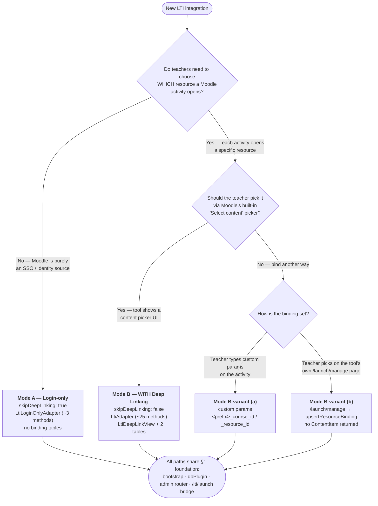
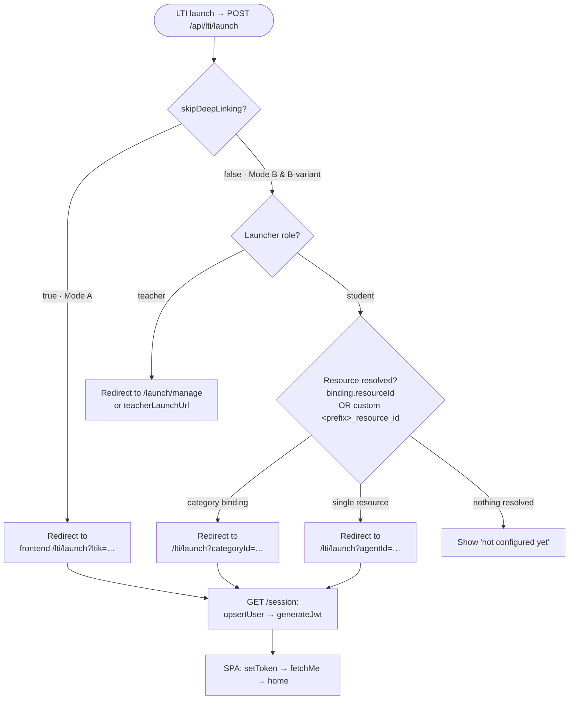

# LTI 1.3 Integration Template — Login-Only SSO Bridge & Full Activity

A fill-in-the-blanks **template** for wiring this module into *any* Express + Vue
app. It documents the two supported integration shapes side by side so you can
pick one, copy the skeletons, and replace the `<PLACEHOLDERS>`.

- **Mode A — Login-only SSO bridge (WITHOUT Deep Linking):** Moodle launch ⇒
  provision/match a user ⇒ mint your app JWT ⇒ done. No teacher content picker.
  ~3 adapter methods. (`skipDeepLinking: true`)
- **Mode B — Full activity (WITH Deep Linking):** teachers pick a course +
  resource inside Moodle; the binding drives where each launch lands. ~25 adapter
  methods. This is the "original" full integration. (`skipDeepLinking: false`)

> Conventions in this doc: `<App>` = your app name, `<prefix>` = your
> `customFieldPrefix` (lowercase, stable), `/api/lti` = your `LTI_MOUNT_PATH`,
> `https://app.example.com` = your public HTTPS base. Swap all of these.

---

## ⚠️ STOP — for the implementing AI: confirm choices BEFORE writing code

**Do not start implementing from this template until you have asked the user the
questions below and gotten explicit answers.** The integration shape is a product
decision, not a default — guessing wrong means rebuilding the adapter, the DB
tables, and the Moodle-side config. Ask first, then implement against the
confirmed answers.

Use a multiple-choice prompt (one question at a time is fine). The **blocking**
questions — you cannot write correct code without these:

1. **Which integration pattern?**
   - (A) Login-only SSO bridge — *without* Deep Linking
   - (B) Full activity — *with* Deep Linking (teacher content picker)
   - (B-variant) Full activity — *without* the Deep Linking picker (custom params / manage page) — see §3.1
2. **ltijs internal state store?** Postgres via `ltijs-sequelize` (recommended) **or** MongoDB (`LTI_DB_URL`)?
3. **Single-tenant or multi-tenant?** (Decides whether `resolveEffectiveTenant` / tenant methods do anything.)
4. **JWT issuance:** reuse the app's existing SSO `signToken` / session JWT, or a dedicated LTI JWT?

**Secondary** questions — sensible defaults exist, but confirm if relevant:

5. **Role promotion from LTI:** should an LTI `teacher` auto-elevate a plain
   student account? (Default: **no** — elevate via admin UI for a clean audit trail.)
6. **Mount path** (`LTI_MOUNT_PATH`, default `/api/lti`) and **`customFieldPrefix`**
   (must stay stable across deploys — changing it breaks existing LMS configs).
7. **Mode B only — launch destination:** full SPA shell (`launchDestination: 'app'`)
   or stripped-down embed widget (`'embed'`)? Skip the built-in teacher manage page
   via `teacherLaunchUrl`?
8. **B-variant only — binding mechanism:** custom parameters, the `/launch/manage`
   page, or both? Do teachers have access to your internal course/resource IDs?

Record the answers (e.g. in the project's LTI notes or the PR description), then
proceed to the matching section. If the user is unsure, walk them through §0.

---

## 0. Pick a mode

| Question | Mode A (Login-only) | Mode B (Full activity) |
|---|---|---|
| Do teachers configure *which content* a Moodle activity opens? | No | Yes |
| Is Moodle just an SSO/identity source? | Yes | No (also identity) |
| Adapter surface | `LtiLoginOnlyAdapter` (3 methods) | `LtiAdapter` (~25 methods) |
| Extra DB tables for bindings | None | `lti_course_maps`, `lti_resource_bindings` |
| Frontend views | `LtiLaunchView` + admin | `LtiLaunchView` + `LtiDeepLinkView` + admin |
| `initLti` flag | `skipDeepLinking: true` | `skipDeepLinking: false` (default) |
| Moodle tool "Deep Linking" support | Off ("Launch only") | On ("Select content") |

You can start with Mode A and graduate to Mode B later — the only code change is
flipping `skipDeepLinking`, swapping the adapter, and adding the two tables +
the deep-link view.

> **Third pattern — full activity WITHOUT the Deep Linking picker.** Deep Linking
> (the content-item picker) and "full activity" (a launch opening a *specific*
> resource) are separable. You can run Mode B with `skipDeepLinking: false` but
> **never enable Moodle's "Select content"** — teachers bind the resource via
> custom parameters or the built-in `/launch/manage` page instead. See **§3.1**.

### 0.1 Selection flow chart — which pattern?

Walk the user through this to land on a pattern (maps to the §STOP questions).



### 0.2 Runtime routing — what happens on a launch

How `onConnect` (in `core.ts`) routes a launch once a pattern is chosen:



### 0.3 Config-time flow — how a binding gets created (Mode B & variant)

```mermaid
flowchart TD
    subgraph DL["Mode B — WITH Deep Linking picker"]
        D1([Teacher clicks 'Select content' in Moodle]) --> D2[onDeepLinking →<br/>redirect /lti/deeplink]
        D2 --> D3[LtiDeepLinkView:<br/>pick course]
        D3 --> D4[GET /deeplink/course/:id/agents:<br/>pick resource or category]
        D4 --> D5[POST /deeplink/submit]
        D5 --> D6[upsertCourseMap +<br/>upsertResourceBinding]
        D6 --> D7[Return signed ContentItem<br/>JWT to Moodle]
    end

    subgraph CP["B-variant (a) — custom parameters"]
        C1([Teacher types params on the activity:<br/>&lt;prefix&gt;_course_id / _resource_id]) --> C2[No tool round-trip —<br/>resolved at launch time by onConnect]
    end

    subgraph MG["B-variant (b) — /launch/manage page"]
        M1([Teacher launches activity normally]) --> M2[Lands on /launch/manage]
        M2 --> M3[Picks course + resource from dropdown]
        M3 --> M4[POST /launch/manage/update →<br/>upsertResourceBinding]
        M4 --> M5[No ContentItem returned to Moodle]
    end
```



---

## 1. Shared foundation (both modes)

These pieces are identical regardless of mode.

### 1.1 Install

```bash
npm install ltijs jsonwebtoken
npm install -D @types/jsonwebtoken
# SQL-backed ltijs state (recommended; avoids running MongoDB):
npm install ltijs-sequelize sequelize pg     # or mysql2 / sqlite3
```

### 1.2 Where the files go

```
<your-backend>/src/lti/
├── index.ts        — bootstrap (template below)
├── adapter.ts      — your adapter (Mode A or B template below)
├── dbPlugin.ts     — ltijs-sequelize factory (template below)   [if SQL]
└── (copied module: core.ts, helpers.ts, types.ts, adminRouter.ts, deepLinkingUI.ts)

<your-frontend>/src/lti/
├── api.ts                 — from frontend/src/api.ts (call configureLtiApi in main.ts)
├── views/LtiLaunchView.vue
└── views/LtiDeepLinkView.vue   [Mode B only]
```

### 1.3 ltijs state storage — `dbPlugin.ts` (SQL template)

ltijs needs its *own* store for registered platforms, OIDC nonces, the tool's JWK
keypair, and the idtoken cache. Keep it isolated from your app's ORM so its
migrations never clash with yours.

```typescript
// src/lti/dbPlugin.ts
import { config } from '../config';

let cached: unknown = null;

export function getLtiSequelizePlugin(): unknown | null {
  if (cached) return cached;
  const { host, name, user, pass, ssl } = config.lti.db;
  if (!host || !name || !user) return null; // caller aborts LTI bring-up

  // eslint-disable-next-line @typescript-eslint/no-var-requires
  const Database = require('ltijs-sequelize');
  cached = new Database(name, user, pass, {
    host,
    dialect: 'postgres',
    logging: false,
    pool: { max: 5, min: 0, acquire: 30_000, idle: 10_000 },
    // Managed Postgres (Neon/Supabase/RDS) needs TLS. Toggle off for local dev.
    ...(ssl ? { dialectOptions: { ssl: { require: true, rejectUnauthorized: false } } } : {}),
  });
  return cached;
}
```

> Prefer MongoDB instead? Skip this file and pass `dbUrl` (or set `LTI_DB_URL`)
> to `initLti`. Everything else stays the same.

### 1.4 Bootstrap — `index.ts` (shared shell)

```typescript
// src/lti/index.ts
import type { Express, RequestHandler } from 'express';
import { initLti, createLtiAdminRouter, setLtiLogger } from 'lti-moodle-integration/backend';
import { config } from '../config';
import { authenticate, requirePermission } from '../middleware/auth';
import { myAdapter } from './adapter';
import { getLtiSequelizePlugin } from './dbPlugin';

// If your app is Express 5 and the module is typed for Express 4, bridge here:
type LtiInitExpress = Parameters<typeof initLti>[0];
type LtiAdminMiddleware = Parameters<typeof createLtiAdminRouter>[0]['adminMiddleware'];

const log = {
  info: (...a: unknown[]) => console.log('[LTI]', ...a),
  warn: (...a: unknown[]) => console.warn('[LTI]', ...a),
  error: (...a: unknown[]) => console.error('[LTI]', ...a),
};

export async function bootstrapLti(app: Express): Promise<void> {
  if (!config.lti.enabled) return log.info('Disabled — skipping');
  if (!config.lti.encryptionKey || config.lti.encryptionKey === '<PLACEHOLDER>') {
    return log.warn('Aborting: LTI_ENCRYPTION_KEY missing/placeholder');
  }
  const dbPlugin = getLtiSequelizePlugin();
  if (!dbPlugin) return log.warn('Aborting: LTI_DB_* not set');

  setLtiLogger(log);

  // Admin platform CRUD — MOUNT BEFORE initLti (shares the path prefix).
  const adminRouter = createLtiAdminRouter({
    adminMiddleware: [authenticate, requirePermission('manage_lti_platforms')] as unknown as LtiAdminMiddleware,
    logger: log,
  });
  app.use(config.lti.mountPath, adminRouter as unknown as RequestHandler);

  if (config.lti.appUrl && !process.env.APP_URL) process.env.APP_URL = config.lti.appUrl;

  await initLti(app as unknown as LtiInitExpress, myAdapter, {
    mountPath: config.lti.mountPath,
    dbPlugin,                              // or: dbUrl: config.lti.dbUrl
    encryptionKey: config.lti.encryptionKey,
    ltiaas: config.lti.ltiaasMode,         // true → bypass 3rd-party cookies in iframes
    skipDeepLinking: config.lti.skipDeepLinking,   // ← MODE SWITCH (A: true, B: false)
    loginOnlyLaunchPath: '/lti/launch',    // Mode A: SPA bridge route
  });

  log.info(`Mounted at ${config.lti.mountPath}`);
}
```

### 1.5 Server entry — call it + the body-parser caveat

```typescript
// src/index.ts (server entry)
import { bootstrapLti } from './lti';

// ⚠️ ltijs registers its OWN body parsers on its routes (e.g. the urlencoded
// OIDC /login POST). If your global parsers drain the stream first, ltijs throws
// "stream is not readable". Skip the global parsers for the LTI mount path:
const skipLti = (parser: RequestHandler): RequestHandler => (req, res, next) => {
  const p = config.lti.mountPath;
  return (req.path === p || req.path.startsWith(`${p}/`)) ? next() : parser(req, res, next);
};
app.use(skipLti(express.json()));
app.use(skipLti(express.urlencoded({ extended: true })));

async function boot() {
  // ...mount your normal routes first...
  await bootstrapLti(app);   // after routes, before listen (initLti is async)
  app.listen(PORT);
}
```

### 1.6 Config block (env-driven)

```typescript
// src/config/index.ts
lti: {
  enabled: boolEnv('LTI_ENABLED', false),       // master switch, off by default
  encryptionKey: env('LTI_ENCRYPTION_KEY'),     // 32 hex chars
  mountPath: env('LTI_MOUNT_PATH', '/api/lti'),
  ltiaasMode: boolEnv('LTI_LTIAAS_MODE', true),
  skipDeepLinking: boolEnv('LTI_SKIP_DEEP_LINKING', /* A: */ true /* B: false */),
  jwtExpiresIn: env('LTI_JWT_EXPIRES_IN', '7d'),
  appUrl: env('APP_URL'),
  db: {
    host: env('LTI_DB_HOST'), name: env('LTI_DB_NAME', 'lti'),
    user: env('LTI_DB_USER'), pass: env('LTI_DB_PASS'),
    ssl: boolEnv('LTI_DB_SSL', true),
  },
},
```

### 1.7 Security middleware (iframe + cross-origin)

LTI launches are form POSTs from Moodle, and the UI runs inside Moodle's iframe.
Loosen Helmet/CORS for the LTI prefix only:

```typescript
app.use(helmet({ contentSecurityPolicy: false, crossOriginEmbedderPolicy: false,
  crossOriginOpenerPolicy: false, crossOriginResourcePolicy: false, xFrameOptions: false }));
app.set('trust proxy', 1); // honour X-Forwarded-Proto behind nginx/Caddy/Cloudflare
```

### 1.8 Platform registration (both modes)

Don't hard-code Moodle creds. Either set the five `LTI_PLATFORM_*` env vars (auto-
registers one platform on boot) **or** register at runtime via the admin UI
(`LtiPlatformsAdmin.vue` → `POST /api/lti/platforms`, guarded by your
`manage_lti_platforms` permission). The admin UI is the only way to register more
than one platform. See `MOODLE_SETUP.md` for the Moodle-side fields.

### 1.9 Frontend bridge route (both modes)

`LtiLaunchView` must be **public** — the launch arrives with a one-shot
`?ltik=...` it exchanges for a real JWT before the user is "signed in".

```typescript
// router/index.ts
{ path: '/lti/launch', name: 'LtiLaunch', component: () => import('@/lti/views/LtiLaunchView.vue') },
// Mode B also: { path: '/lti/deeplink', name: 'LtiDeepLink', component: () => import('@/lti/views/LtiDeepLinkView.vue') },
router.beforeEach((to, _f, next) =>
  to.name?.toString().startsWith('Lti') ? next() : /* your auth guard */ next());
```

`LtiLaunchView` logic: read `ltik` → `GET /api/lti/session?ltik=...` **with a bare
axios call** (bypass your Bearer interceptor so a stale token doesn't stomp the
public request) → `authStore.setToken(token)` → `fetchMe()` →
`router.replace(target ?? '<your home route>')`.

---

## 2. Mode A — Login-only SSO bridge (WITHOUT Deep Linking)

### Architecture

```
Moodle                 Tool (ltijs, skipDeepLinking)        Your SPA
  │  OIDC login  ──────────▶│                                  │
  │  ◀── redirect ──────────│                                  │
  │  LTI launch  ──────────▶│ onConnect():                     │
  │                         │  skipDeepLinking → redirect to   │
  │                         │  {frontend}/lti/launch?ltik=…    │
  │                         │ ────────────────────────────────▶│ LtiLaunchView
  │                         │  GET /session?ltik= ◀────────────│
  │                         │  upsertUser()→generateJwt()      │
  │                         │  { token, role } ───────────────▶│ setToken→fetchMe→home
```

The only LTI claim consumed is the user identity (email, name, role, `sub`).

### Adapter template (3 methods)

```typescript
// src/lti/adapter.ts
import jwt from 'jsonwebtoken';
import type { LtiLoginOnlyAdapter, LtiUser, LtiRole } from 'lti-moodle-integration/backend';
import { UserModel } from '../models/User';
import { config } from '../config';

function mapRole(role: LtiRole): string[] {
  return role === 'teacher' ? ['teacher'] : ['student'];
}

export const myAdapter: LtiLoginOnlyAdapter = {
  customFieldPrefix: '<prefix>',

  async upsertUser({ email, name, role, externalId }): Promise<LtiUser> {
    // 1) Prefer matching by the stable LTI subject if you store it.
    if (externalId) {
      const hit = await UserModel.findByLtiSubject(externalId, 'lti');
      if (hit) return { id: hit.id, email: hit.email, name: hit.name, roles: hit.roles };
    }
    // 2) Fall back to your existing SSO findOrCreate (match by email / institutional id).
    const user = await UserModel.findOrCreate({ email, name /*, roles: mapRole(role) */ });
    // 3) Persist (subject, platform) so future launches match without email.
    if (externalId) await UserModel.linkLtiIdentity(user.id, externalId, 'lti');
    void mapRole; // ← decide: auto-promote role on LTI? (see decision note)
    return { id: user.id, email: user.email, name: user.name, roles: user.roles };
  },

  generateJwt(user: LtiUser) {
    const token = jwt.sign(
      { sub: user.id, roles: user.roles, email: user.email },
      config.jwtSecret,
      { expiresIn: config.lti.jwtExpiresIn as jwt.SignOptions['expiresIn'] },
    );
    return { token, expiresIn: /* seconds */ 7 * 24 * 3600 };
  },

  resolveEffectiveTenant(): string | undefined {
    return undefined; // single-tenant. Multi-tenant: return the tenant id.
  },
};
```

### Decision notes (fill these in per project)

- **Role promotion:** decide whether an LTI `teacher` should auto-elevate a
  user who is currently a plain student. Safer default: **don't** — promote via
  your admin UI to keep an audit trail. The hook is the `void mapRole` line.
- **Identifier matching:** standard LTI claims rarely carry an institutional UID.
  Match by `sub` then email unless you wire a custom claim.
- **Moodle tool setting:** configure the external tool as **Launch only** (not
  "Select content") so teachers never hit a deep-link surface that doesn't exist.

---

## 3. Mode B — Full activity (WITH Deep Linking)

This is the "original" integration: teachers configure each Moodle activity to
point at one of your resources (or a category of them), and launches route
students straight to the bound resource.

### Architecture

```
Moodle                         Tool (ltijs)                         Your SPA
  │ Deep-link launch ─────────▶│ onDeepLinking() → /lti/deeplink ──▶│ LtiDeepLinkView
  │                            │ GET /deeplink/data  ◀──────────────│ (pick course)
  │                            │ GET /deeplink/course/:id/agents ◀──│ (pick resource)
  │                            │ POST /deeplink/submit ◀────────────│ (save)
  │ ◀── signed deep-link JWT ──│  upsertResourceBinding()           │
  │                            │                                    │
  │ Normal launch  ───────────▶│ onConnect():                       │
  │                            │  findResourceBinding() →           │
  │                            │  teacher → /launch/manage          │
  │                            │  student → {frontend}/lti/launch?agentId=…
  │                            │ ──────────────────────────────────▶│ LtiLaunchView → resource
```

### Extra DB tables

Add the two LTI tables (these store the LMS↔app mapping; *separate* from ltijs's
internal store):

- `lti_course_maps` — one row per LMS course context →
  `(issuer, clientId, deploymentId, contextId)` ⇒ your `courseId`.
- `lti_resource_bindings` — one row per LMS activity (adds `resourceLinkId`) ⇒
  either `resourceId` (single) or `categoryId` (category binding).

Copy the schema for your stack:
- Mongoose: `backend/src/models/*.mongoose.ts`
- Drizzle: `backend/src/models/drizzle-schema.example.ts`
- Raw Postgres: `backend/src/models/schema.sql`

### Adapter template (full `LtiAdapter`)

Start from a reference adapter and fill in your ORM:
- `backend/src/adapters/mongoose.example.ts`
- `backend/src/adapters/drizzle.example.ts`

Group the ~25 methods by concern (full contract documented in `types.ts`):

| Concern | Methods you implement |
|---|---|
| UI strings | `deepLinkPageTitle`, `resourceLabel`, `customFieldPrefix` |
| Users | `resolveTeacherByEmail`, `resolveOrProvisionTeacher`, `upsertUser`, `generateJwt` |
| Courses | `listCoursesForTeacher`, `getCourseForTeacher`, `getCourseById`, `suggestCourses`, `findCourseByCourseId(ForTeacher)` |
| Resources | `listSelectableResources`, `getSelectableResourceForDeepLinking`, `getResourceById?` |
| Categories (optional) | `listSelectableCategories?`, `getCategoryById?`, `listCategoryAgents?` |
| Enrollment | `ensureResourceInCourse`, `ensureTeacherInCourse`, `ensureStudentInCourse` |
| Mapping | `findCourseMap`, `upsertCourseMap`, `findResourceBinding`, `upsertResourceBinding` |
| Tenants | `resolveEffectiveTenant`, `resolveTenantFromBinding`, `grantTeacherTenantAccess`, `getTenantMode?` |
| Optional | `buildDeepLinkItems?`, `getStudentScore?` (grade passback), `getResourceAnalytics?` |

### Mode-B specifics to set

- `initLti({ skipDeepLinking: false })` (the default).
- `LtiInitOptions.launchDestination`: `'app'` (full SPA shell, `/lti/launch?agentId=…`)
  or `'embed'` (`/embed/:resourceId` widget).
- `teacherLaunchUrl?` — set to skip the built-in `/launch/manage` page and send
  teachers straight to a URL (`{courseId}` / `{resourceId}` placeholders).
- `autoMapCourse` (default true) — fuzzy-match the Moodle course to one of yours
  on first deep link. `autoEnrollStudents` — add learners to the mapped course
  on launch.
- Copy `LtiDeepLinkView.vue`; if you skip category methods, pass
  `:category-supported="false"`.
- Moodle tool: enable **"Supports Deep Linking / Select content"**.

### 3.1 Variant — full activity WITHOUT the Deep Linking picker

"Deep Linking" (the content-item picker) and "full activity" (a launch that opens
a *specific* resource) are separable. You can run a full, resource-specific
activity **without ever invoking the Deep Linking message flow** — the teacher
just binds the resource a different way. Two mechanisms, both supported by the
same `onConnect` resolution (`binding?.resourceId || resourceIdFromCustom`):

**(a) Custom parameters** — the teacher types them into Moodle's External Tool
activity config (no picker, no content-item handshake):

```
<prefix>_course_id=<your-internal-course-id>
<prefix>_resource_id=<your-internal-resource-id>
```

`onConnect` reads `custom.<prefix>_course_id` / `custom.<prefix>_resource_id`
(falling back to `courseId` / `agentId`) and routes the student straight to that
resource.

**(b) Built-in `/launch/manage` page** — on a normal (non-deep-link) launch,
teachers land on the tool's own management page and pick course + resource from a
dropdown; the inline form posts to `/launch/manage/update`, which calls
`upsertResourceBinding` directly. No ContentItem is ever returned to Moodle.

**What you set for this variant:**

- `skipDeepLinking: **false**` — REQUIRED. The custom-param routing and the
  `/launch/manage` page both live behind this flag. (Login-only mode short-
  circuits `onConnect` before any resource resolution.)
- Moodle tool: leave **"Select content" / Deep Linking OFF**. Teachers configure
  via custom params (a) or the manage page (b).
- The adapter is still the **full `LtiAdapter`** — you need `findResourceBinding`,
  `upsertResourceBinding`, `getCourseById`, `getSelectableResourceForDeepLinking`,
  etc. (the `/deeplink/*` picker routes are simply never hit).

**Caveats / decisions:**

- **Custom params expose internal IDs.** Teachers must know your `courseId` /
  `resourceId`. Surface them in your app UI (a "copy LTI params" button) or rely
  on mechanism (b). Removing this friction is the whole point of Deep Linking — so
  prefer (b) for non-technical teachers.
- **No lean flag yet.** There's currently no option to register `onConnect`
  resource routing while skipping the `/deeplink/*` picker routes — those routes
  get registered whenever `skipDeepLinking: false`. If you want a truly minimal
  surface (custom-param routing only, no picker/manage routes), that's a small
  module enhancement: add a flag (e.g. `bindingMode: 'custom-params'`) that guards
  only the picker-route registration block in `core.ts`, leaving `onConnect`'s
  resolution intact.

```
Moodle (no deep linking)         Tool (skipDeepLinking:false)        Your SPA
  │ activity has custom params:        │                                  │
  │   <prefix>_course_id=…             │                                  │
  │   <prefix>_resource_id=…           │                                  │
  │ normal launch ────────────────────▶│ onConnect():                     │
  │                                    │  resolvedResourceId =            │
  │                                    │   binding?.resourceId            │
  │                                    │   || custom <prefix>_resource_id │
  │                                    │  student → /lti/launch?agentId=… │
  │                                    │ ─────────────────────────────────▶│ → resource
```

---

## 4. Reference — Deep Linking & what Moodle sends

### 4.1 What "Deep Linking" actually is

LTI 1.3 has **two launch message types**, and Deep Linking is just one of them:

| Message type | When Moodle sends it | ltijs entry point |
|---|---|---|
| `LtiResourceLinkRequest` | A **normal launch** — a user clicks an already-configured activity. | `onConnect` |
| `LtiDeepLinkingRequest` | A **content-selection launch** — a teacher clicks **"Select content"** while setting up the activity. | `onDeepLinking` |

**The Deep Linking round-trip (content picker):**

1. Teacher adds an *External Tool* activity and clicks **Select content**.
2. Moodle fires a `LtiDeepLinkingRequest` through `/login` → `/launch`; ltijs
   hands it to `onDeepLinking`, which redirects the teacher's iframe to your
   picker (`/lti/deeplink` → `LtiDeepLinkView`).
3. The teacher picks a course + resource (or category). The frontend POSTs to
   `/deeplink/submit`.
4. Your tool persists the binding (`upsertResourceBinding`) **and** builds a
   signed **deep-linking response JWT** containing one or more **ContentItems**
   (`lti.DeepLinking.createDeepLinkingMessage` / `createDeepLinkingForm`).
5. That JWT is auto-submitted to Moodle's `deep_link_return_url`. Moodle stores
   the returned resource link — **including any `custom` params your ContentItem
   attached** (e.g. `<prefix>_course_id`, `<prefix>_resource_id`).
6. Every later student click is a plain `LtiResourceLinkRequest` carrying those
   stored custom params + a stable `resource_link.id` — which is exactly what
   `onConnect` reads to route the student.

So Deep Linking's job is purely **configuration-time**: it lets the teacher pick
content in *your* UI and writes the choice back into Moodle, so you never make
teachers hand-type internal IDs. The `deepLinkingSettings` claim (only present on
a `LtiDeepLinkingRequest`) carries `deep_link_return_url`, `accept_types`,
`accept_presentation_document_targets`, and an opaque `data` round-trip value.

> **Why the B-variant skips it:** if the binding is set another way (custom params
> or `/launch/manage`), you never need the picker round-trip — `onConnect` still
> resolves the resource from the stored binding or the custom claim.

### 4.2 Parameters you can retrieve from a Moodle launch

ltijs validates the launch `id_token` and normalises it into `res.locals.token`
(+ `res.locals.context`). The module's `helpers.ts` exposes typed getters for the
useful claims. **Everything you can pull from a launch:**

| What | Helper (`ltiHelpers.*`) | LTI 1.3 claim / source | Notes |
|---|---|---|---|
| Issuer (platform id) | `getIssuerFromLtiToken(token)` | `iss` | Identifies the Moodle instance. Part of the binding key. |
| Client ID | `getClientIdFromLtiToken(token)` | `aud` / `client_id` | Per-tool OAuth client. Part of the binding key. |
| Deployment ID | `getDeploymentIdFromLtiToken(token)` | `…/claim/deployment_id` | Part of the binding key. |
| User subject | from `token.userInfo.sub` | `sub` | Stable per-platform user id. Use to match users (see `getExternalIdFromLti`). |
| Email | `getEmailFromLtiToken(token)` | `email` / `lis.person_contact_email_primary` | **Requires Moodle privacy = "Always share email".** Lowercased. |
| Name | `getNameFromLtiToken(token)` | `name` / `given_name` + `family_name` | Requires "Always share name". |
| Role (normalised) | `inferRoleFromLti(res)` | `…/claim/roles` | `'teacher'` if roles contain Instructor / TeachingAssistant / Administrator, else `'student'`. |
| Raw roles | `res.locals.token.platformContext.roles` | `…/claim/roles` | Full IRI array if you need finer-grained role logic. |
| Context (course) id | `getContextId(res)` | `…/claim/context.id` | Moodle's internal course id. Part of the binding key. |
| Context label / title | `res.locals.context.context.{label,title}` | `…/claim/context` | Short code + full course name. Used by auto-map. |
| Resource link id | `getResourceLinkId(res)` | `…/claim/resource_link.id` | Stable per *activity*. Distinguishes two activities in one course. |
| Custom parameters | `getCustom(res)` | `…/claim/custom` | Map of the params you (or the teacher) set. See §4.3. |
| External / institutional id | `getExternalIdFromLti(res)` | `lis.person_sourcedid` | Numeric only (e.g. student number); `''` otherwise. |
| LIS sourcedids | `res.locals.context.lis` | `…/claim/lis` | `course_section_sourcedid`, `course_offering_sourcedid`, etc. |
| Deep-link settings | `token.platformContext.deepLinkingSettings` | `…/claim/deep_linking_settings` | **Only on `LtiDeepLinkingRequest`.** Has `deep_link_return_url`. |
| Course-id candidates | `guessLmsCourseIdentifiers(res)` | derived | Fuzzy list (context id, custom, LIS, label/title → variants) for auto-mapping. |

```typescript
import { ltiHelpers } from 'lti-moodle-integration/backend';
// inside an onConnect / route handler with (token, req, res):
const email   = ltiHelpers.getEmailFromLtiToken(token);
const role    = ltiHelpers.inferRoleFromLti(res);
const course  = ltiHelpers.getContextId(res);
const linkId  = ltiHelpers.getResourceLinkId(res);
const custom  = ltiHelpers.getCustom(res);          // { '<prefix>_resource_id': '...' }
```

> **Don't know what your Moodle is actually sending?** Set `LTI_DEBUG_CLAIMS=true`
> and launch — `core.ts` dumps the full structured claim breakdown *and* the raw
> token JSON to your logger (`[LTI] onConnect — Moodle launch claims …`). This is
> the fastest way to see precisely which fields your LMS populates.

### 4.3 Custom parameters — setting them in Moodle, reading them in the tool

Custom params are the simplest way to pass tool-specific data through a launch.

**Set them in Moodle** (External Tool activity → *Show more…* → **Custom
parameters**, one `key=value` per line):

```
<prefix>_course_id=COURSE-123
<prefix>_resource_id=RES-456
```

Or they're attached automatically to the ContentItem your tool returns during
Deep Linking (step 5 above), so the teacher never types them.

**Read them in the tool** via `getCustom(res)`. `onConnect` already uses them as
the fallback when no stored binding exists:

```341:342:lti-moodle-integration/backend/src/core.ts
      const resolvedResourceId = binding?.resourceId || resourceIdFromCustom;
      const resolvedCourseId = binding?.courseId || courseIdFromCustom;
```

Caveats: Moodle lowercases custom keys; keep `customFieldPrefix` stable (changing
it orphans every existing LMS-side config); and custom params reference **your**
internal IDs, so surface them in your UI if teachers set them by hand.

---

## 5. Verification checklist (all patterns)

1. `LTI_ENABLED=true`, key + DB vars set → restart. Boot log: `[LTI] Mounted at /api/lti`.
2. `GET /api/lti/keys` returns a JWK set.
3. Register the platform (env or admin UI). Boot log or UI confirms.
4. **Mode A:** launch as a student → land in `/lti/launch?ltik=…` → redirected
   home, signed in. **Mode B:** launch as a teacher → deep-link picker →
   save → re-launch as a student → land on the bound resource.

### Common failures

| Symptom | Cause / fix |
|---|---|
| `stream is not readable` on `/login` | Body-parser skip guard (§1.5) missing or wrong mount path. |
| SPA: "Missing launch token" | Opened `/lti/launch` directly, or proxy stripped `?ltik=`. |
| "LTI launch did not include an email" | Moodle: *Share launcher's email = Always*. |
| Admin platform calls return 503 | LTI enabled but provider not initialised — check boot logs for missing key/DB. |
| Iframe blocked (Chrome 3rd-party cookies) | `LTI_LTIAAS_MODE=true`. |
| Mode B: "not configured yet" though a binding row exists | Adapter `customFieldPrefix` ≠ the prefix used in custom-claim fallback. |

---

## 6. Where to look next

- `INTEGRATION_GUIDE.md` — the long-form drop-in checklist (per-step).
- `ARCHITECTURE.md` — module internals, adapter pattern, full deep-link flows.
- `MOODLE_SETUP.md` — Moodle external-tool configuration (identical for both modes).
- `backend/src/adapters/login-only.example.ts` — Mode A reference adapter.
- `backend/src/adapters/{mongoose,drizzle}.example.ts` — Mode B reference adapters.
