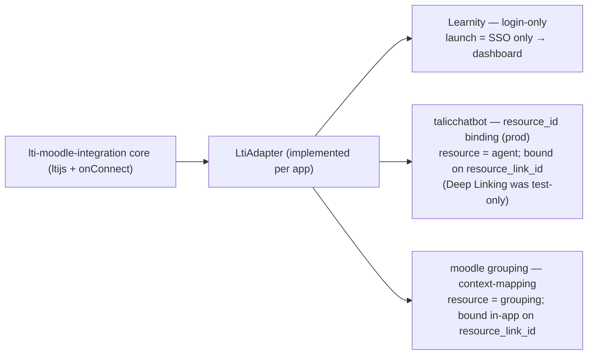
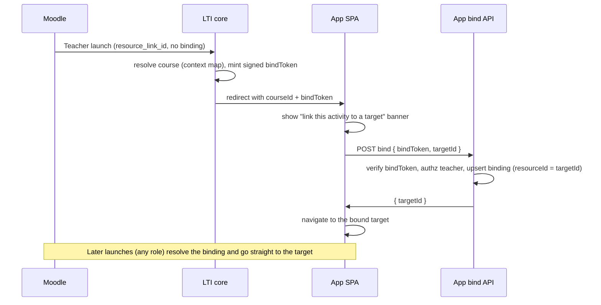
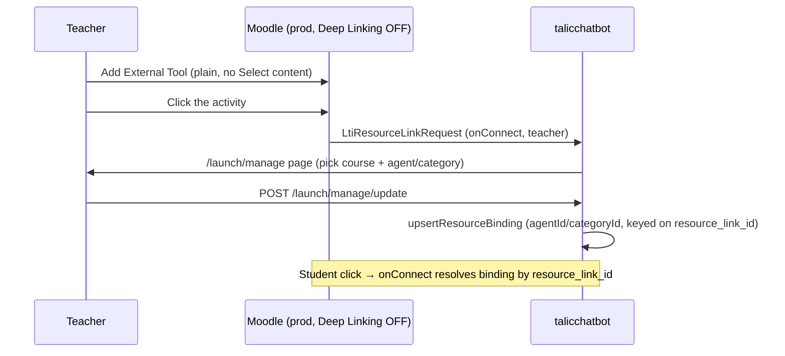

# LTI 1.3 Integration — Agent-Executable Guide

You are an AI coding agent integrating the portable `lti-moodle-integration`
package into an Express + SPA application. This guide is the executable companion
to `LTI_INTEGRATION_MANUAL.md` (the human-readable version). Follow it top to
bottom. Do **not** skip the decision gate.

Conventions used below: `<App>` = the target app, `<prefix>` = the adapter's
`customFieldPrefix` (lowercase, stable), `/api/lti` = `LTI_MOUNT_PATH`,
`https://app.example.com` = the public HTTPS base. Replace all placeholders.

---

## ⛔ STOP — confirm choices before writing any code

The integration shape is a product decision, not a default. Guessing wrong means
rebuilding the adapter, the DB tables, and the Moodle-side configuration. Ask the
user the blocking questions below (a multiple-choice prompt is ideal), record the
answers, and only then implement against them.

**Blocking questions (you cannot write correct code without these):**

1. **Connect mode?**
   - `login-only` — Moodle is purely an SSO/identity source. *(Recommended when no per-activity target is needed.)*
   - `context-mapping` — plain external-tool launch; a course is mapped on launch and each activity can bind to a target in-app. *(Recommended default.)*
   - `deep-linking` — teacher picks content via Moodle's "Select content" picker. *(Only if the LMS exposes Deep Linking — confirm it does before choosing this.)*
2. **LTI package state store?** SQL via `ltijs-sequelize` (recommended) or MongoDB (`LTI_DB_URL`)?
3. **Single-tenant or multi-tenant?** (Decides whether the tenant adapter methods do anything.)
4. **JWT issuance?** Reuse the app's existing session JWT, or mint a dedicated LTI JWT?

**Secondary questions (sensible defaults exist; confirm if relevant):**

5. **Role promotion:** should an LTI instructor launch elevate an existing student account to teacher? (This app: yes, additive only; never grants admin.)
6. **Mount path** (`LTI_MOUNT_PATH`) and **`customFieldPrefix`** (must stay stable across deploys).
7. **Context-mapping only — per-link binding:** will activities bind to a specific target (grouping)? If yes, you will add a bind endpoint and `LTI_BIND_TOKEN_SECRET` (Phase 4).

> **Recommend login-only or context-mapping.** Do **not** enable Moodle's "Select
> content" / Deep Linking unless the user has confirmed their LMS supports it. See
> the production lesson in §Use cases.

After answers are recorded, proceed. If the user is unsure, walk them through the
decision tree in §Mode selection.

---

## Use cases (read before choosing a mode)

One package serves three live HKU TELI deployments:

| Deployment | Connect mode | A launch opens | How the binding is set | Adapter surface |
|---|---|---|---|---|
| Learnity | login-only | nothing — SSO only, lands on dashboard | n/a | ~3 methods |
| talicchatbot | Deep Linking (test only) → `resource_id` binding workaround in production | an agent / chatbot | originally Moodle "Select content"; production binds on `resource_link_id` via the tool's manage page (Deep Linking disabled in prod) | full adapter |
| moodle grouping (this app) | context-mapping | a grouping | in-app, bound on `resource_link_id` via a bind token (no Deep Linking) | full adapter |

> **Production lesson:** Deep Linking works in a permissive test Moodle, but
> production Moodle admins frequently disable "Select content". talicchatbot hit
> this and switched to a `resource_id` binding workaround. Recommend login-only or
> context-mapping; treat Deep Linking as optional/LMS-dependent.



The `resource_id` binding pattern without Deep Linking (the context-mapping path,
highlighted because it replaces Deep Linking on an LMS that lacks it):



talicchatbot, testing vs production (both bind on `resource_link_id`; only the
binding UI differs):



---

## Mode selection

```mermaid
flowchart TD
    Start([New LTI integration]) --> Q1{Does the LMS need to know<br/>WHICH content an activity opens?}
    Q1 -->|No — Moodle is SSO only| A["login-only<br/>~3-method adapter, no binding tables"]
    Q1 -->|Yes| Q2{Does the LMS expose Deep Linking<br/>'Select content'? (confirm!)}
    Q2 -->|No / unsure| CM["context-mapping (recommended)<br/>full adapter; per-link binding via bind token"]
    Q2 -->|Yes| DL["deep-linking<br/>full adapter + content picker"]
```

Default to `context-mapping` unless the user explicitly needs pure SSO
(`login-only`) or has confirmed Deep Linking support (`deep-linking`).

---

## Phase 1 — Shared foundation (all modes)

### 1.1 Install dependencies

```bash
npm install ltijs jsonwebtoken
npm install -D @types/jsonwebtoken
# SQL-backed ltijs state (recommended; avoids running MongoDB):
npm install ltijs-sequelize sequelize pg     # or mysql2 / sqlite3
```

### 1.2 Config block (env-driven)

Read every value from the environment; never inline secrets or URLs. Add to your
typed config:

```typescript
lti: {
  enabled: boolEnv('LTI_ENABLED', false),
  encryptionKey: env('LTI_ENCRYPTION_KEY'),
  dbUrl: env('LTI_DB_URL'),                 // or use a SQL dbPlugin
  mountPath: env('LTI_MOUNT_PATH', '/api/lti'),
  ltiaasMode: boolEnv('LTI_LTIAAS_MODE', true),
  connectMode: env('LTI_CONNECT_MODE', 'context-mapping'),
  // context-mapping per-link binding only:
  bindTokenSecret: env('LTI_BIND_TOKEN_SECRET', LTI_BIND_TOKEN_SECRET_FALLBACK),
},
```

`LTI_BIND_TOKEN_SECRET_FALLBACK` must be an imported constant, not a string
literal inlined here.

### 1.3 Bootstrap

```typescript
import { initLti, createLtiAdminRouter, setLtiLogger } from '<lti-package>';
import { myAdapter } from './adapters/myAdapter';
import { authenticate, authorize } from '../middleware/auth';
import { config } from '../config';

export async function bootstrapLti(app: Express): Promise<void> {
  if (!config.lti.enabled) return;
  setLtiLogger({ info: console.log, warn: console.warn, error: console.error });

  // Admin platform CRUD — mount BEFORE initLti (shared path prefix; first match wins).
  const adminRouter = createLtiAdminRouter({
    adminMiddleware: [authenticate, authorize('admin')],
  });
  app.use(config.lti.mountPath, adminRouter);

  await initLti(app, myAdapter, {
    mountPath: config.lti.mountPath,
    dbUrl: config.lti.dbUrl,
    connectMode: config.lti.connectMode,        // ← mode switch
    loginOnlyLaunchPath: '/lti/launch',          // SPA bridge route
    autoMapCourse: true,
    autoEnrollStudents: true,
    bindTokenSecret: config.lti.bindTokenSecret, // context-mapping per-link binding
  });
}
```

### 1.4 Server entry — body-parser skip guard (critical)

`ltijs` registers its own body parsers on its routes. If global parsers run
first, the launch fails with `stream is not readable`. Skip global parsers for
the LTI mount path (but NOT for your own JSON endpoints that merely share a
prefix):

```typescript
const skipLti = (parser: RequestHandler): RequestHandler => (req, res, next) =>
  req.path === config.lti.mountPath || req.path.startsWith(`${config.lti.mountPath}/`)
    ? next()
    : parser(req, res, next);
app.use(skipLti(express.json({ limit: '1mb' })));
app.use(skipLti(express.urlencoded({ extended: true })));
```

### 1.5 Security middleware

```typescript
app.use(helmet({ contentSecurityPolicy: false, crossOriginEmbedderPolicy: false,
  crossOriginResourcePolicy: false }));
app.set('trust proxy', 1);
```

### 1.6 Frontend bridge route (public)

`/lti/launch` must be public. Read `ltik` → exchange at the session endpoint for
an app JWT (with a bare HTTP call that bypasses your Bearer interceptor) → set
the token → load the profile → navigate to the target. For context-mapping,
forward `courseId`, and (if present) `groupingId` and `bindToken` to your course
route.

**Verification gate 1:** `GET https://app.example.com/api/lti/keys` returns a JWK
set. Boot logs show the LTI subsystem mounted. Do not continue until both pass.

---

## Phase 2 — Adapter

- **login-only:** implement the ~3-method login-only adapter (`upsertUser`,
  `generateJwt`, `resolveEffectiveTenant`). Stop after Phase 1 + this; skip
  Phases 3–4.
- **context-mapping / deep-linking:** implement the full adapter. Group the
  methods: users, courses (incl. provisioning), resources (your "target"), the
  course map (`findCourseMap`/`upsertCourseMap`), and the resource binding
  (`findResourceBinding`/`upsertResourceBinding`). In this app the target is a
  grouping; store the grouping id in the binding's resource slot. Set the three
  UI strings and a stable `customFieldPrefix`.

**Verification gate 2:** a teacher launch logs course resolution; a student
launch logs course-map resolution and (deep-linking) binding resolution.

---

## Phase 3 — Moodle registration

Register the External Tool (LTI 1.3, Keyset URL, the three URLs). Privacy: share
name and email **Always**.

- login-only / context-mapping: **Deep Linking OFF**, no Content Selection URL.
- deep-linking: **Deep Linking ON** + Content Selection URL.

Copy the Client ID / Deployment ID / endpoints into config or register via the
admin screen.

**Verification gate 3:** the platform is registered (boot log or admin UI), and a
real launch from Moodle reaches the tool.

---

## Phase 4 — Context-mapping per-link binding (only if targets are bound)

This makes each activity open a specific target without Deep Linking. Implement
all of the following:

1. **Core (`context-mapping` branch):** on a teacher launch, after resolving the
   course, look up the binding for `resource_link_id`. If found, redirect to the
   target; if not, mint a signed bind token and redirect to the course with it
   (also send a fresh token when bound, to allow re-binding). On a student
   launch: if a binding exists, redirect to the target (auto-enroll on the
   session bridge); if not, return a server-rendered "contact your teacher" page
   (no picker fallback). Add an `initLti` option `bindTokenSecret`, a JWT mint
   helper, an exported `verifyBindToken`, and a TTL constant.

   ```typescript
   // mint on teacher launch (claims = launch identity)
   const bindToken = jwt.sign(
     { issuer, clientId, deploymentId, contextId, resourceLinkId, courseId },
     secret,
     { expiresIn: BIND_TOKEN_TTL_SECONDS },
   );
   ```

2. **Config + wiring:** add `bindTokenSecret` to config (env
   `LTI_BIND_TOKEN_SECRET` with an imported-constant fallback) and pass it into
   `initLti`.

3. **Shared grouping service:** extract the target-creation logic into a service
   reused by both the normal create endpoint and the bind endpoint (no
   duplication).

4. **Bind endpoint** — `POST /api/v1/lti/bindings`, authenticated, teacher/admin:

   ```typescript
   // verify token → load course → assert teacher/admin → optionally create target
   // → upsertResourceBinding({ ...tuple, resourceLinkId, courseId, resourceId: targetId, createdBy })
   // → return { success: true, groupingId: targetId }
   ```

   Body: `{ bindToken, groupingId? , newGrouping?: { name, description?, settings? } }`
   (exactly one of `groupingId` / `newGrouping`). Validate with Zod; use the
   project's `asyncHandler` + `AppError`. Put the endpoint path in `constants/`.

5. **Frontend:** forward `bindToken` from the launch bridge to the course route;
   when `bindToken` is present and the user can manage the course, show a
   dismissible "link this Moodle activity to a grouping" banner (select existing /
   create new) wired through a `controllers/` helper that posts to the bind
   endpoint. On success, drop the banner and set `?grouping=<id>`. Honor mobile
   UX (min tap target height, focus-visible/active states).

6. **Shared types:** add `bindToken?` to the launch-query type and add bind
   request/response DTOs reused by backend and frontend.

**Verification gate 4:** teacher launch of an unbound activity shows the banner;
binding it then sends students straight to the target; an unbound activity shows
students the "contact your teacher" page; a second activity binds to a different
target.

---

## Final verification (all modes)

1. Backend boots with `LTI_ENABLED=true`; keyset reachable; platform registered.
2. login-only: student launch → dashboard, signed in.
3. context-mapping: teacher launch → bind banner → pick target → student
   relaunch → lands on the target, auto-enrolled.
4. deep-linking: teacher launch → content picker → save → student relaunch →
   lands on the bound resource.
5. Update project docs (changelog, features, env table) for any new env vars or
   user-visible behavior.
